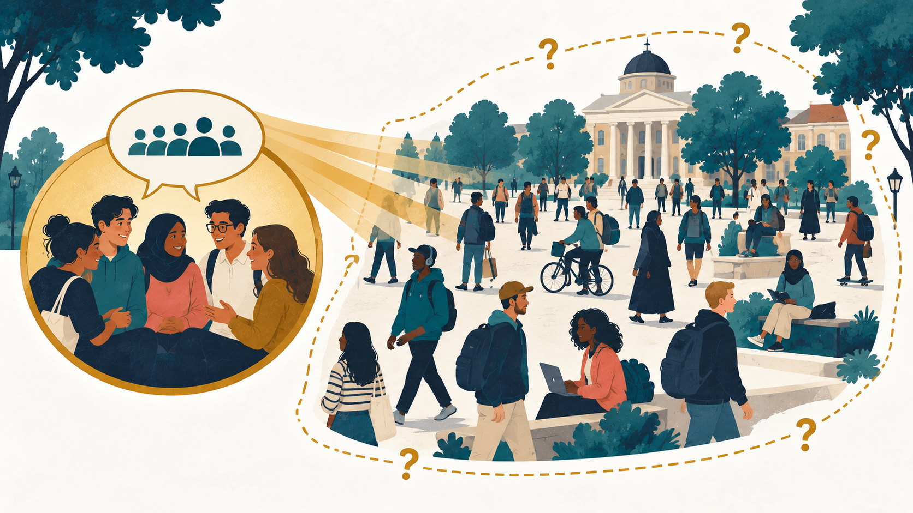
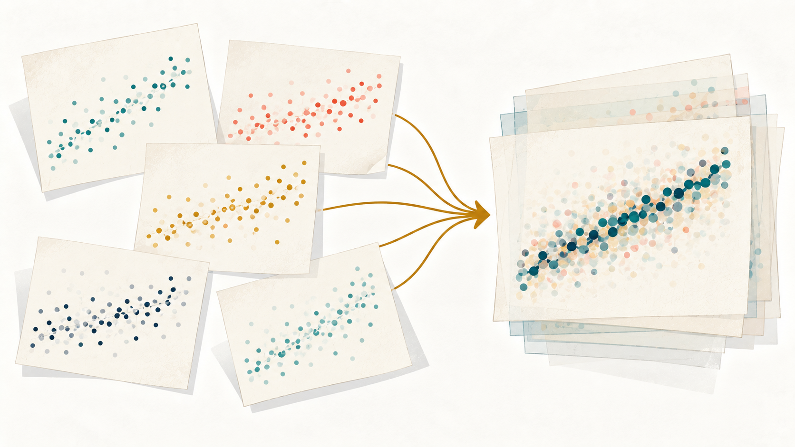
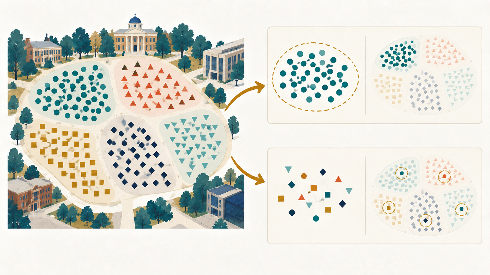

## قبل أن نبدأ...

<!-- ::: {.question-box} -->

<!-- من منكم فكّر عندما رأى اسم المقرر لأول مرة: -->

<!-- **«هل ستكون مناهج البحث صعبة؟»** -->

<!-- ::: -->

. . .

::: takeaway
هدفنا: أن نفهم البحث بوصفه **طريقة تفكير**، لا مجموعة تعريفات نحفظها.
:::

::: {.small .center}
تعلّموا أن تسائلوا حتى ما يُقدَّم لكم بوصفه «حقيقة»: **ما الدليل؟ كيف عرفنا؟ وهل يوجد تفسير آخر؟**
:::

## البحث أقرب إلينا مما نتوقع

عندما نختار مطعمًا، غالبًا ما:

```{=html}
<!--1. نسأل سؤالًا: إلى أي مطعم نذهب؟
2. نجمع معلومات: تقييمات، صور، آراء.
3. نقارن بين الخيارات.
4. نتخذ قرارًا.-->
```

{.chapter-figure .figure-sequence width="90%" fig-alt="طالبة تنتقل من سؤال عن المطعم إلى جمع المعلومات والمقارنة ثم اتخاذ القرار."}

::: board
سؤال ← بيانات ← تحليل ← نتيجة
:::

<!-- ## خريطة الفصل -->

<!-- ::::: columns -->
<!-- ::: {.column width="50%"} -->
<!-- - العلم والمعرفة -->
<!-- - القياس والاستقراء -->
<!-- - التفسير والتنبؤ -->
<!-- ::: -->

<!-- ::: {.column width="50%"} -->
<!-- - سمات العلم -->
<!-- - العلوم الاجتماعية كعلم -->
<!-- ::: -->
<!-- ::::: -->

<!-- ::: takeaway -->
<!-- السؤال الذي سيتكرر طوال المقرر: **كيف عرفنا؟** -->
<!-- ::: -->

## لماذا نحتاج إلى العلم؟

الإنسان يواجه ظواهر:

- سياسية
- اقتصادية
- اجتماعية

ويسأل:

::: {.large .center}
**لماذا حدثت؟ وكيف حدثت؟ وهل يمكن أن تتكرر؟**
:::

## مصادر معرفتنا اليومية

::::: columns
::: {.column width="50%"}
### نعرف من...

- التجربة الشخصية
- الأهل والعادات
- الديوانية
- الأخبار ووسائل التواصل
:::

::: {.column width="50%"}
### لكننا نسأل...

- هل المعلومة دقيقة؟
- هل التجربة تمثل الجميع؟
- هل يمكننا اختبارها؟
- هل يوجد دليل؟
:::
:::::

## ما العلم؟

::: concept-card
العلم هو **معرفة منظمة** قائمة على الملاحظة والتجربة، وتهدف إلى فهم الظواهر وتفسيرها.
:::

. . .

::: question-box
**سؤال:**

هل التسويق عن طريق المؤثرين ناجح؟
:::

## من سؤال عام إلى سؤال أكثر تحديدًا

::: question-box
**نحدد المنصة والمنتج:**

هل التسويق عن طريق المؤثرين على إنستغرام وتيك توك يزيد مبيعات منتجات المكياج؟
:::

. . .

::: question-box
**ثم نضيّق النطاق أكثر:**

هل التسويق عن طريق المؤثرين على سناب شات يزيد طلبات المطاعم؟
:::

. . .

::: board
المعرفة العلمية = سؤال واضح + دليل + طريقة واضحة سؤال أكثر تحديدًا ← قياس أوضح ← اختبار أدق
:::

## المعرفة العادية والمعرفة العلمية

| المعرفة العادية        | المعرفة العلمية    |
|------------------------|--------------------|
| تجربة أو انطباع        | ملاحظة منظمة       |
| «الناس يقولون»         | دليل يمكن فحصه     |
| قد تكون صحيحة أو خاطئة | تُختبر بطريقة واضحة |
| يصعب معرفة حدودها      | تذكر حدود النتيجة  |

::: small
المعرفة اليومية ليست خاطئة بالضرورة؛ لكنها لا تصبح علمية قبل أن نختبرها.
:::

## ادعاء أم دليل؟

:::::: columns
:::: {.column width="55%"}
::: question-box
«جميع طلبة الجامعة يسهرون؛ لأن جميع أصدقائي يسهرون.»
:::

ما الذي نحتاج إلى معرفته؟

- من الذين سألناهم؟
- هل يمثلون كل الطلبة؟
- ما المقصود بكلمة «يسهرون»؟
- هل لدينا بيانات كافية؟
::::

::: {.column width="43%"}
{.chapter-figure .figure-side width="100%" fig-alt="مجموعة صغيرة من الأصدقاء تشغل جزءًا واحدًا فقط من مجتمع جامعي أكبر وأكثر تنوعًا."}
:::
::::::

## طريقان لبناء المعرفة

::::::: columns
:::: {.column width="48%"}
::: concept-card
**القياس**

[Deductive Reasoning]{.term-en}

من **العام** إلى **الخاص**
:::
::::

:::: {.column width="48%"}
::: concept-card
**الاستقراء**

[Inductive Reasoning]{.term-en}

من **الخاص** إلى **العام**
:::
::::
:::::::

## القياس: من النظرية إلى الاختبار

::: arrow-flow
نظرية عامة ↓ توقع محدد ↓ اختبار بالبيانات
:::

::: example-box
**نظرية:** الدعم الاجتماعي يقلل العزلة.

**توقع:** الطلبة الذين يتمتعون بدعم قوي سيشعرون بعزلة أقل.
:::

## مثال على القياس

1.  كل كواكب المجموعة الشمسية تدور حول الشمس.
2.  الأرض كوكب في المجموعة الشمسية.
3.  إذن الأرض تدور حول الشمس.

::: takeaway
إذا المقدمات صحيحة والمنطق سليم، تتبعها النتيجة.
:::

<!-- ## حدود القياس وفائدته -->

<!-- ::::: columns -->
<!-- ::: {.column width="48%"} -->
<!-- ### يفيدنا في... -->

<!-- - تنظيم المعرفة الموجودة. -->
<!-- - تطبيق النظرية على حالة محددة. -->
<!-- - اشتقاق فروض وتوقعات قابلة للاختبار. -->
<!-- ::: -->

<!-- ::: {.column width="48%"} -->
<!-- ### لكنه لا... -->

<!-- - يكتشف الأسباب أو العلاقات وحده. -->
<!-- - يقدم دليلًا ميدانيًا جديدًا بنفسه. -->
<!-- - ينتج نتيجة تتجاوز محتوى مقدماته. -->
<!-- ::: -->
<!-- ::::: -->

<!-- ::: takeaway -->
<!-- سلامة المنطق لا تكفي إذا كانت المقدمات نفسها غير صحيحة. -->
<!-- ::: -->

## الاستقراء: من الملاحظة إلى النظرية

::: arrow-flow
ملاحظات خاصة ↑ نمط متكرر ↑ تعميم أو نظرية
:::

::: example-box
نلاحظ ارتفاع معدلات الطلاق في أكثر من مجتمع، ثم ندرس العوامل المتكررة ونبني تفسيرًا أوسع.
:::

## سؤال سريع

::: question-box
قابلنا خمسة طلبة، وكلهم قالوا إنهم يفضلون المحاضرات الصباحية.

بعدها قلنا: «طلبة الجامعة يفضلون الصباح».

**قياس ولا استقراء؟**
:::

. . .

::: takeaway
**استقراء**: انتقلنا من ملاحظات خاصة إلى تعميم عام.
:::

## القياس والاستقراء يعملان معًا

:::::::::::: cycle-stage
:::: {.cycle-overview .fragment .fade-out data-fragment-index="0"}
::: board
ملاحظة ← فكرة ← توقع ← اختبار ← تعديل الفكرة
:::

- الاستقراء يساعدنا نبني الأفكار والنظريات.
- القياس يساعدنا على اشتقاق توقعات واختبارها.
- البحث العلمي يتحرك بين الاثنين باستمرار.
::::

::::::::: {.research-cycle .fragment .current-visible data-fragment-index="0"}
::: {.cycle-step .cycle-observation}
[ملاحظة]{.cycle-label}

لاحظنا أن بعض الشركات تستخدم المؤثرين كثيرًا
:::

::: {.cycle-step .cycle-idea}
[فكرة عامة]{.cycle-label}

ربما المؤثرون يزيدون المبيعات
:::

::: {.cycle-step .cycle-prediction}
[توقّع]{.cycle-label}

إذن نتوقع أن الحملات مع المؤثرين ستحقق مبيعات أعلى
:::

::: {.cycle-step .cycle-test}
[اختبار]{.cycle-label}

نجمع البيانات ونختبر الفكرة
:::

::: {.cycle-step .cycle-revision}
[مراجعة]{.cycle-label}

إذا لم تدعمها البيانات نعدّل الفكرة
:::

::: cycle-key
[الاستقراء: من الملاحظة إلى الفكرة]{.key-induction} [القياس: من الفكرة إلى التوقّع والاختبار]{.key-deduction}
:::
:::::::::

<!-- :::: {.cycle-overview .cycle-overview-return .fragment data-fragment-index="1"} -->

<!-- ::: {.board} -->

<!-- ملاحظة ← فكرة ← توقع ← اختبار ← تعديل الفكرة -->

<!-- ::: -->

<!-- - الاستقراء يساعدنا نبني الأفكار والنظريات. -->

<!-- - القياس يساعدنا على اشتقاق توقعات واختبارها. -->

<!-- - البحث العلمي يتحرك بين الاثنين باستمرار. -->

<!-- :::: -->
::::::::::::

::: {.small .center}
النتيجة قد تدعم الفكرة أو تدفعنا إلى تعديلها.
:::

## المعرفة العلمية تتراكم

```{=html}
<!-- - الدراسة الواحدة لا تقدم حكمًا نهائيًا.
- نكرر الاختبار مع عينات وأوقات وظروف مختلفة.
- تقارب النتائج يزيد ثقتنا بالتفسير.
- التعميم المسؤول يحتاج إلى أدلة متراكمة. -->
```

{.chapter-figure .figure-evidence width="72%" fig-alt="دراسات منفصلة تحمل أنماطًا متفاوتة، وعند جمعها يظهر اتجاه مشترك أكثر وضوحًا."}

::: board
نتيجة أولية ← تكرار الاختبار ← تراكم الأدلة ← تعميم بحذر
:::

::: takeaway
قوة المعرفة العلمية تأتي من **تراكم النتائج**، لا من دراسة واحدة مشهورة.
:::

## الوصف لا يساوي التفسير

::::::: columns
:::: {.column width="48%"}
::: concept-card
**الوصف**

**ماذا حدث؟**

«ارتفع معدل الطلاق.»
:::
::::

:::: {.column width="48%"}
::: concept-card
**التفسير**

**لماذا حدث؟**

ما العوامل المرتبطة بهذا الارتفاع؟
:::
::::
:::::::

## الظواهر الاجتماعية متعددة الأسباب

::::::::::: board
:::::::::: causal-diagram
::: causal-outcome
الظاهرة الاجتماعية
:::

::: {.causal-arrow .diagonal aria-hidden="true"}
↗
:::

::: {.causal-arrow aria-hidden="true"}
↑
:::

::: {.causal-arrow .diagonal aria-hidden="true"}
↖
:::

::: causal-factor
عامل ثقافي
:::

::: causal-factor
عامل أسري
:::

::: causal-factor
عامل اقتصادي
:::
::::::::::
:::::::::::

- نادرًا ما يوجد سبب واحد.
- العوامل تتفاعل مع بعضها.
- التفسير السريع قد يخفي جزءًا كبيرًا من الصورة.

## نوعان من التفسير

::::: columns
::: {.column width="48%"}
### التفسير القياسي

[Deductive Explanation]{.term-en}

نطبق نظرية أو قانونًا عامًا على حالة محددة.
:::

::: {.column width="48%"}
### التفسير الاحتمالي

[Probabilistic Explanation]{.term-en}

عامل معين **يزيد أو يقلل احتمال** حدوث النتيجة.
:::
:::::

::: takeaway
في العلوم الاجتماعية: يغيّر السبب غالبًا **احتمال** النتيجة، لكنه لا يضمنها.
:::

## التنبؤ أو التوقع

[Prediction]{.term-en}

- العلم يحاول توقع ما قد يحدث لاحقًا.
- التوقع مبني على نظرية وبيانات.
- التوقع ليس تنجيمًا، ولا يمثل ضمانًا.

::: board
التنبؤ العلمي = بيانات + نظرية + احتمال
:::

## أهداف العلوم الاجتماعية

::::: columns
::: {.column width="48%"}
- **الفهم والتفسير:** لماذا تحدث الظاهرة؟
- **التنبؤ:** متى قد تتكرر؟
:::

::: {.column width="48%"}
- **الحد والسيطرة:** كيف نخفف المشكلة؟
- **تحسين الوضع الإنساني:** كيف ندعم النتائج المرغوبة؟
:::
:::::

::: takeaway
كلما فهمنا الظاهرة بصورة أفضل، أصبح بإمكاننا اتخاذ قرارات أفضل—لكن دون ادعاء السيطرة الكاملة على السلوك الإنساني.
:::

## العلوم الطبيعية والعلوم الاجتماعية

::::: columns
::: {.column width="48%"}
### العلوم الطبيعية

إذا ارتفعت حرارة الحديد، يتمدد.

قوانين أكثر ثباتًا وظروف أسهل في الضبط.
:::

::: {.column width="48%"}
### العلوم الاجتماعية

التنبؤ بالجريمة أو السلوك أصعب.

البشر والمجتمعات يتغيرون ويتأثرون بعوامل كثيرة.
:::
:::::

## الخوارزميات تتنبأ... لكنها لا تقرأ الأفكار

::: example-box
خوارزمية تيك توك تحاول تتوقع:

**أي مقطع سنشاهده حتى النهاية؟**
:::

- تستخدم أنماطًا في البيانات.
- تنتج احتمالًا، لا يقينًا.
- قد تنجح أحيانًا، وقد تعرض علينا أحيانًا أخرى مقطعًا لا يناسب اهتماماتنا.

## سبع سمات للعلم

::: {.small .center}
هذه **سمات مثالية**؛ قد لا تتوافر كلها بالدرجة نفسها في كل نشاط علمي.
:::

::::: columns
::: {.column width="48%"}
1.  منطقي [Logical]{.term-en}
2.  يبحث عن الأسباب [Deterministic]{.term-en}
3.  قابل للتعميم [General]{.term-en}
4.  محدد [Specific]{.term-en}
:::

::: {.column width="48%"}
5.  قابل للتحقق [Verifiable]{.term-en}
6.  قابل للفحص بين الباحثين [Intersubjective]{.term-en}
7.  قابل للتعديل [Open to Modification]{.term-en}
:::
:::::

## ١–٢: المنطق والبحث عن الأسباب

### منطقي

المقدمات والنتائج لازم تكون مترابطة.

### يبحث عن الأسباب

الظواهر لا تحدث من فراغ؛ بل نحاول اكتشاف العوامل التي ساهمت فيها.

::: takeaway
البحث عن السبب في المجتمع **لا يعني** وجود سبب واحد أو نتيجة مضمونة.
:::

## من الرأي الشائع إلى سؤال بحثي

::: question-box
«طلبة الجامعة ما يحبون يقرون.»
:::

. . .

::: board
كم ساعة بالأسبوع، في المتوسط (on average)، يقضي طلبة الجامعة في قراءة مواد المقرر؟
:::

**الرأي الشائع** (stereotype) قد يكون صحيحًا أو خاطئًا؛ العلم يحوله إلى سؤال قابل للفحص.

## ٣: التعميم يحتاج إلى عينة ممثلة

::::::: {.columns .smaller}
::::: {.column width="40%"}
::: example-box
إذا سألنا عشرة من أصدقائنا، فستكون لدينا معلومات عن أصدقائنا...

**لا عن جميع طلبة جامعة الكويت.**
:::

- العينة الكبيرة ليست ممثلة دائمًا. <!-- - طريقة اختيار العينة مهمة. -->
- نعمم فقط على المجتمع الذي تمثله بياناتنا.

::: board
<!-- عينة ممثلة ← تعميم مسؤول -->

الحجم وحده لا يكفي؛ **طريقة الاختيار مهمة.**
:::
:::::

::: {.column width="58%"}
{.chapter-figure .figure-sampling width="100%" fig-alt="عينة كبيرة مأخوذة من مجموعة واحدة مقارنة بعينة أصغر موزعة على مجموعات المجتمع المختلفة."}
:::
:::::::

## ٤: التحديد والتعريف الإجرائي [Operationalization]{.term-en}

مفاهيم مثل:

**محافظ · ليبرالي · ذكي · مهتم بالسياسة**

مفاهيم مجردة تحتاج إلى قياس واضح.

::: board
مفهوم مجرد ← تعريف إجرائي ← مؤشرات قابلة للقياس
:::

::: small
مثال: الاهتمام السياسي ← سؤال من صفر إلى عشرة، أو عدد مرات متابعة الأخبار.
:::

## كيف نقيس «التأثير»؟

::: question-box
إذا أردنا قياس تأثير حساب في إنستغرام، فما المؤشر الذي نستخدمه؟
:::

- عدد المتابعين؟
- عدد الإعجابات؟
- التعليقات والمشاركات؟
- القدرة على تغيير رأي الناس؟

::: takeaway
كل مقياس يلتقط جانبًا مختلفًا من المفهوم.
:::

## ٥: إمكانية التحقق

[Verifiable]{.term-en}

الباحث يوضح:

- من شارك في الدراسة؟
- كيف جمع البيانات؟
- كيف قاس المفاهيم؟
- كيف حلل النتائج؟

::: takeaway
«صدقوني، أنا باحث» ليست منهجًا علميًا.
:::

## كلمة «أثبتت» تحتاج إلى حذر

::: question-box
«دراستي أثبتت إن السوشال ميديا تسبب التعاسة.»
:::

نسأل:

- كيف قسنا التعاسة؟
- من كان ضمن العينة؟
- سبب أم مجرد ارتباط؟
- هل توجد عوامل أخرى؟

## ٦: الفحص بين الباحثين

[Intersubjective]{.term-en}

- الباحثون بشر وقد يتأثرون بخلفياتهم وقيمهم.
- نقلل التحيز عن طريق الوضوح والنقد ومراجعة الآخرين.
- باحثون مختلفون يقدرون يفحصون الطريقة والأدلة.

::: board
الموضوعية ليست ادعاءً شخصيًا؛ بل هي إجراءات تسمح للآخرين بالفحص.
:::

## ٧: العلم قابل للتعديل

::::::: {.columns .smaller}
::::: {.column width="40%"}
[Open to Modification]{.term-en}

::: arrow-flow
دليل جديد ← مراجعة ← تعديل النظرية أو استبدالها
:::

::: takeaway
عندما يغيّر العلم موقفه استجابةً لدليل أقوى، فهذه **نقطة قوة** وليست ضعفًا.
:::
:::::

::: {.column width="58%"}
{.chapter-figure .figure-revision width="100%" fig-alt="مسار بحثي يُصحح جزئيًا عندما يكشف دليل جديد أن الطريق السابق غير صالح."}
:::
:::::::

## هل العلوم الاجتماعية «علم»؟

العلوم الاجتماعية:

- تدرس الظواهر الاجتماعية والسلوك الإنساني.
- تستخدم مناهج البحث العلمي.
- تحاول تفسير الأنماط وبناء تعميمات.
- تتعامل مع موضوع معقد ومتغير: **الإنسان**.

::: example-box
للإنسان وعي وقيم ودوافع، وقد يغيّر سلوكه لأنه يعرف أنه موضع دراسة.
:::

## لماذا البحث الاجتماعي أصعب؟

- **التعقيد:** الظاهرة الواحدة تتأثر بمتغيرات كثيرة ومتفاعلة.
- **التجربة:** يصعب أحيانًا ضبط الظروف أو إجراء تجربة على البشر.
- **القياس:** مفاهيم مثل السعادة والذكاء لها مقاييس متعددة وغير كاملة.
- **خلفية الباحث:** ممكن خلفية الباحث ووجهة نظره تأثر على الأسئلة اللي يختارها وشلون يفسر النتائج.

::: small
رأى **فيبر** إمكان السعي إلى الحياد القيمي، بينما رأى **غولدنر** استحالة فصل البحث عن القيم فصلًا تامًا.
:::

::: takeaway
هذه الصعوبات لا تلغي علمية البحث الاجتماعي؛ لكنها تتطلب وضوحًا وحذرًا أكبر.
:::

<!-- ## ثلاثة مواقف حول علمية العلوم الاجتماعية -->

<!-- ::::::::: columns -->
<!-- :::: {.column width="32%"} -->
<!-- ::: concept-card -->
<!-- **الإرادة الحرة** -->

<!-- [Beccaria]{.term-en} -->

<!-- الإنسان يختار سلوكه؛ لذلك يصعب التنبؤ به بقوانين عامة. -->
<!-- ::: -->
<!-- :::: -->

<!-- :::: {.column width="32%"} -->
<!-- ::: concept-card -->
<!-- **الوضعية** -->

<!-- [Positivism]{.term-en} -->

<!-- يمكن دراسة الظواهر الاجتماعية بطرق شبيهة بطرق العلوم الطبيعية. -->
<!-- ::: -->
<!-- :::: -->

<!-- :::: {.column width="32%"} -->
<!-- ::: concept-card -->
<!-- **الموقف الوسطي** -->

<!-- [Weber]{.term-en} -->

<!-- تفيدنا الطرق العلمية، لكنها لا تكفي دون فهم المعاني والدوافع. -->
<!-- ::: -->
<!-- :::: -->
<!-- ::::::::: -->

<!-- ## دوركايم وفيبر: كيف ندرس المجتمع؟ -->

<!-- ::::::: columns -->
<!-- :::: {.column width="48%"} -->
<!-- ::: concept-card -->
<!-- **دوركايم** -->

<!-- [Durkheim]{.term-en} -->

<!-- ندرس **الوقائع والأنماط الاجتماعية** كأشياء موجودة خارج الفرد وتؤثر عليه. -->
<!-- ::: -->
<!-- :::: -->

<!-- :::: {.column width="48%"} -->
<!-- ::: concept-card -->
<!-- **فيبر** -->

<!-- [Weber]{.term-en} -->

<!-- نفهم **المعاني والدوافع** التي يعطيها الناس لسلوكهم. -->
<!-- ::: -->
<!-- :::: -->
<!-- ::::::: -->

## نحتاج إلى المنظورين

::::: columns
::: {.column width="48%"}
### كم؟

ما نسبة الطلبة الذين يستخدمون ChatGPT؟

نحتاج أرقامًا وأنماطًا.
:::

::: {.column width="48%"}
### لماذا؟

لماذا يستخدمونه؟ وهل يعدّونه مساعدة أم غشًا؟

نحتاج فهم المعاني والتجارب.
:::
:::::

::: takeaway
كل سؤال بحثي يحتاج الأداة المناسبة.
:::

## العلوم الاجتماعية والسياسة العامة

البحث يساعد صانع القرار على فهم:

- حجم المشكلة
- من يتأثر بها
- أسبابها المحتملة
- البدائل المتاحة
- هل نجح الحل؟

::: board
مشكلة عامة ← بيانات ← بدائل ← سياسة ← تقييم [Evaluation ← Policy ← Possible solutions ← Data ← Public problem]{.term-en}
:::

## مثال: الازدحام في الكويت

قبل ما نقترح حلًا، نحتاج نعرف:

- متى وأين يحدث الازدحام؟
- لماذا يفضّل الناس السيارة؟
- هل النقل العام مناسب؟
- كيف تؤثر أوقات المدارس والعمل؟
- هل المشكلة في الطرق فقط؟

::: takeaway
الحل الجيد يستهدف **السبب**، لا العرض وحده.
:::

## تحدٍ سريع

::: question-box
اختاروا مشكلة عامة في الكويت:

**الزحمة · الإسكان · التعليم · الصحة**

ما أول ثلاث معلومات نحتاج إليها قبل أن نقترح حلًا؟
:::

<!-- ## البحث لا يتحول تلقائيًا إلى سياسة -->

<!-- قد تواجه البحوث: -->

<!-- - مصالح وضغوطًا سياسية -->
<!-- - بيانات ناقصة -->
<!-- - رغبة في حل سريع -->
<!-- - ضعف التواصل مع صانع القرار -->
<!-- - عدم استخدام النتائج -->

<!-- ::: takeaway -->
<!-- لا تعتمد السياسة على البيانات وحدها... لكن لا ينبغي لها تجاهل البيانات. -->
<!-- ::: -->

<!-- ## لماذا تظهر فجوة بين البحث والسياسة؟ -->

<!-- ::::: columns -->
<!-- ::: {.column width="48%"} -->
<!-- ### الباحثون -->

<!-- - يقبلون النظريات المؤقتة والقابلة للتعديل. -->
<!-- - يهتمون ببناء المعرفة والتفسير. -->
<!-- - يطلبون وقتًا لاختبار النتائج. -->
<!-- - يفضلون الشفافية وإتاحة البيانات. -->
<!-- ::: -->

<!-- ::: {.column width="48%"} -->
<!-- ### صانعو السياسات -->

<!-- - يحتاجون إجابات واضحة لاتخاذ القرار. -->
<!-- - يبحثون عن حلول وبدائل عملية. -->
<!-- - يريدون التنبؤ والحد من المشكلة سريعًا. -->
<!-- - قد تفرض مؤسساتهم السرية على البيانات. -->
<!-- ::: -->
<!-- ::::: -->

<!-- ::: takeaway -->
<!-- تقريب الفجوة يحتاج إلى تواصل مستمر، وبيانات متاحة، وتوقعات واقعية من الطرفين. -->
<!-- ::: -->

## معوقات البحث العلمي في الدول العربية

::::: columns
::: {.column width="48%"}
- ضعف الإنفاق على البحث العلمي
- غياب استراتيجيات وأولويات بحثية واضحة
- نقص الباحثين والكوادر الفنية المؤهلة
- ضعف المراكز والمكتبات والبنية التحتية
- قلة المراكز والمعاهد المتخصصة
:::

::: {.column width="48%"}
- هجرة العقول والكفاءات
- ضعف التعاون واستخدام نتائج البحوث
- صعوبة الوصول إلى البيانات الحكومية
- الاعتماد على نظريات ومقاييس غربية قد لا تلائم المجتمع
- ضعف التعاون بين الجامعات والمؤسسات الحكومية
- ضعف الاستفادة من نتائج البحوث في السياسات والخطط
:::
:::::

## من المعوقات إلى الحلول

::::: columns
::: {.column width="48%"}
### نحتاج...

- تمويلًا مستدامًا
- استراتيجية بحثية واضحة
- مؤسسات بحثية قوية
- تدريبًا وفرصًا للباحثين
:::

::: {.column width="48%"}
### ونحتاج...

- شراكات مع الجهات الحكومية
- مشاركة بيانات مسؤولة
- تطوير مقاييس ونظريات محلية
- استخدام النتائج في القرار
:::
:::::

## خلاصة الفصل

::: board
نسأل ← نلاحظ ← نختبر ← نفسر ← نتوقع بحذر ← نعدّل
:::

- العلم معرفة منظمة، وليس مجرد رأي.
- القياس والاستقراء طريقان متكاملان.
- المعرفة العلمية تقوى بالتكرار وتراكم الأدلة.
- الظواهر الاجتماعية غالبًا متعددة الأسباب واحتمالية.
- البحث الجيد واضح، قابل للفحص، وقابل للتعديل.
<!-- - البحث والسياسة لهما أولويات مختلفة، لكنهما يحتاجان إلى بعضهما. -->


::: takeaway
العلم ليس مجموعة حقائق نحفظها؛ بل هو **طريقة تفكير**.
:::

## مشروع الفصل: مقترح بحثي

::: takeaway
الهدف النهائي: إعداد **مقترح بحثي** متكامل.
:::

- اعملوا في مجموعات من **٢–٤ طلبة**.
- اختاروا قضية أو ظاهرة اجتماعية تثير اهتمامكم.
- طوّروا معًا أسئلة تودون دراستها.

::: board
التسليم النهائي = **مقترح مكتوب** + **عرض تقديمي أمام الصف**
:::

::: {.center .large}
كل بحث جيد يبدأ بفضول وسؤال.
:::

## ماذا يتضمن المقترح؟

::: smaller
1.  **المقدمة**
    - وصف المشكلة أو الظاهرة.
    - توضيح أهميتها ولماذا تستحق الدراسة.
    - قد تكون غير مدروسة في الكويت، أو لم تُدرس من هذه الزاوية من قبل.
2.  **سؤال البحث أو الفرضية**
    - ماذا تريدون أن تعرفوا أو تختبروا؟
3.  **المنهج المقترح**
    - كيف ستجيبون عن السؤال أو تختبرون الفرضية؟
    - استبانة، أو ملاحظة، أو مقابلات معمقة، أو تجربة، أو مزيج منها.
:::

## المطلوب تسليمه: الثلاثاء ٦ أكتوبر، ١١:٥٩ مساءً

::: question-box
1.  كوّنوا مجموعة من **٢–٤ طلبة**.
2.  اختاروا قضية أو ظاهرة اجتماعية تهمكم.
3.  سلّموا بضعة **أسئلة بحثية أولية** تودون دراستها.
:::

::: takeaway
لا يُشترط أن تكون الأسئلة مثالية من البداية؛ سنعمل على تطويرها خلال الفصل.
:::

## مصادر الفصل

::: small
- الثاقب، فهد. *المدخل في البحث الاجتماعي*، الفصل الأول.
- عرض الفصل الأول الأصلي لمقرر مناهج البحث الاجتماعي (د. حسين الفضلي).
:::
