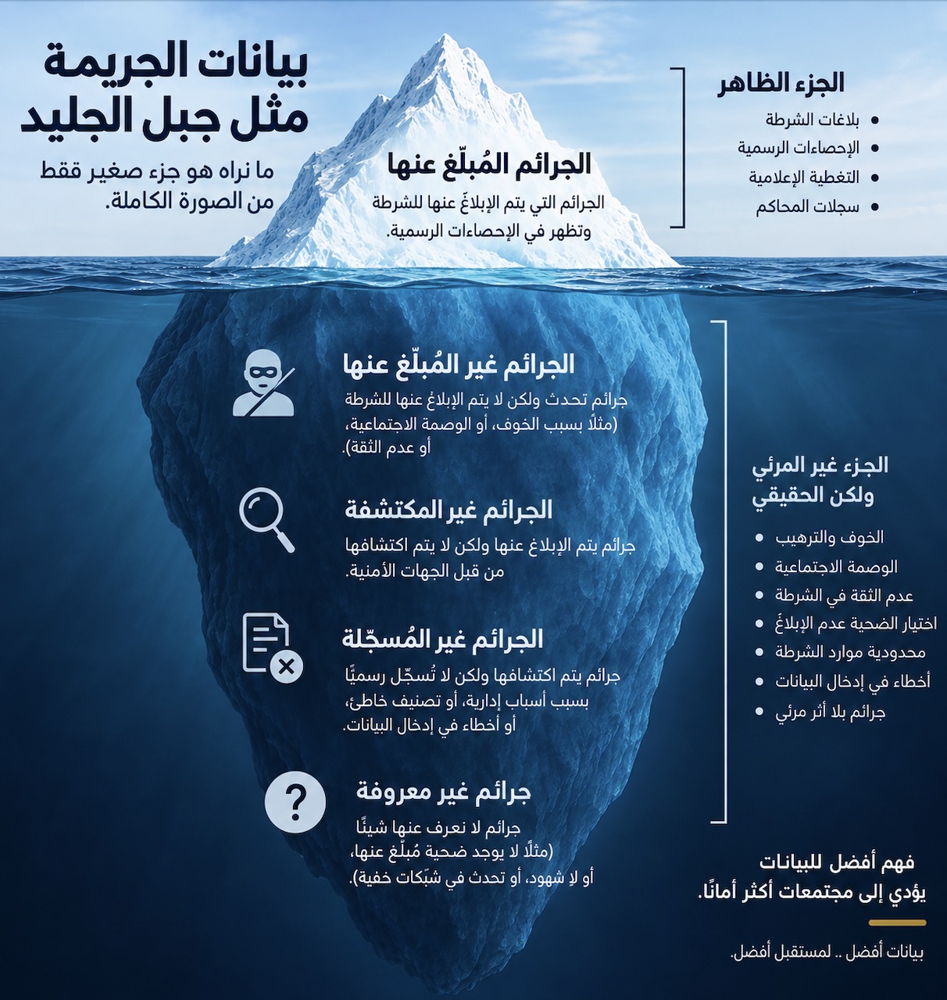

## المحاضرة الأولى: من الادعاء إلى سؤال قابل للبحث

::: {.lecture-divider}
**استرجاع من الفصل الأول**

ما الدليل؟ كيف عرفنا؟ وهل يوجد تفسير آخر؟
:::

::: {.small .center}
الاثنين ٢١ سبتمبر
:::

## هل يكفي هذا الادعاء لبدء بحث؟

::::: {.columns}
:::: {.column width="56%"}
::: {.question-box}
«إذا شعر الطالب أن رأيه يخالف الرأي السائد في مجموعة طلابية، فسوف يلتزم الصمت.»
:::

::: {.small}
**الادعاء (Claim):** عبارة تقول إن شيئًا ما صحيح، أو تتوقع علاقة؛ وهي تحتاج إلى دليل، ولا تُعد دليلًا بحد ذاتها.
:::

::: {.fragment}
قبل جمع أي بيانات، نحتاج إلى أن نسأل:

- كيف سنعرف **الرأي السائد**؟
- ماذا نعني بـ **الصمت أو التعبير**؟
- أي طلبة وأي مجموعات نقصد؟
- هل نتوقع علاقة أم أثرًا سببيًا؟
:::
::::

:::: {.column width="40%"}
{.case-photo}

::::
:::::

## البيانات لا تتحدث وحدها

::: {.concept-card}
البحث العلمي ليس جمع أكبر كمية ممكنة من المعلومات؛ بل جمع **البيانات المناسبة** للإجابة عن **سؤال محدد**.
:::

:::: {.visual-grid style="grid-template-columns:1fr .18fr 1fr .18fr 1fr;"}
::: {.visual-node}
فكرة مبدئية
:::
::: {.visual-arrow}
←
:::
::: {.visual-node .fragment}
سؤال يعمل كمرشّح
:::
::: {.visual-arrow .fragment}
←
:::
::: {.visual-node .fragment}
بيانات نحتاج إليها
:::
::::

::: {.small}
«إذا لم تكن لدينا فكرة تقودنا، فلن نعرف ما الحقائق التي ينبغي جمعها» (Cohen, 1956, p. 148، كما ورد في كتاب الفصل).
:::

## الموضوع الواسع ليس مشكلة بحث

:::: {.funnel}
<svg class="funnel-outline" viewBox="0 0 100 100" preserveAspectRatio="none" aria-hidden="true">
  <path d="M 2 2 H 98 L 64 73 V 98 H 36 V 73 Z" fill="none" stroke="#2A8C87" stroke-width="1.6" vector-effect="non-scaling-stroke"/>
</svg>

::: {.funnel-step}
مجال واسع: التعبير عن الرأي عبر الإنترنت
:::
::: {.funnel-step}
ظاهرة: الصمت في المجموعات الطلابية
:::
::: {.funnel-step}
مشكلة: لا نعرف كيف يرتبط إدراك الرأي السائد بقرار التعبير
:::
::: {.funnel-step}
سؤال محدد قابل للبحث
:::
::::

::: {.takeaway}
المشكلة البحثية تحدد ما نريد أن نعرفه، لا المجال الذي نهتم به فقط.
:::

## من أين تأتي المشكلات البحثية؟

:::: {.columns}
::: {.column width="48%"}
- ملاحظة ظاهرة اجتماعية
- خبرة الباحث الأكاديمية أو المهنية
- وسائل الإعلام والنقاش العام
:::

::: {.column width="48%"}
- الكتب والدوريات العلمية
- نتائج دراسة سابقة
- حاجة مؤسسة أو جهة ممولة
:::
::::

::: {.board}
المصدر يولّد الفكرة، لكن الأدبيات تصقلها.
:::

## البحث حلقة في سلسلة

تساعد مراجعة الدراسات السابقة على معرفة:

- ما الذي نعرفه بالفعل؟
- كيف عُرّفت المفاهيم وقِيست؟
- ما النظريات والفروض المستخدمة؟
- ما الأخطاء والحدود التي ظهرت؟
- ما السؤال الذي بقي بلا جواب؟

::: {.takeaway}
لا يبدأ العلم من الصفر، ولا يكرر ما سبقه بلا إضافة.
:::

::: {.small}
سنعود في الفصل الثالث إلى كيفية بناء مراجعة أدبيات مترابطة؛ المطلوب هنا هو تحديد موقع السؤال داخل المعرفة المتاحة.
:::

## كيف تحدد مراجعة الأدبيات الفجوة البحثية؟

::: {.term-en}
Literature Review
:::

::: {.small}
لا تكفي عبارة: **«لم أجد دراسة مطابقة تمامًا»**.

قد تظهر الفجوة عندما:

- تتعارض نتائج الدراسات السابقة
- لا يشمل الدليل مجتمعًا أو سياقًا مهمًا
- تستخدم الدراسات مقياسًا محدودًا
- يبقى تفسير بديل بلا اختبار
- تتغير الظاهرة ويحتاج الدليل إلى تحديث
:::

::: {.board}
الفجوة = سؤال مهم لا يجيب عنه الدليل المتاح بصورة كافية
:::

## الأصالة ليست اختراع موضوع جديد

قد تأتي الإضافة من:

::::: {.columns}
:::: {.column width="48%"}
- سؤال أو تفسير مختلف
- مجتمع أو سياق لم يُدرس جيدًا
- مقياس أو منهج أنسب
::::

:::: {.column width="48%"}
- عينة أو وحدة تحليل مختلفة
- اختبار حدّ من حدود نتيجة سابقة
- تكرار منهجي يفحص إمكان إعادة النتيجة
::::
:::::

::: {.example-box}
الصمت عبر الإنترنت ليس موضوعًا جديدًا، لكن دراسة **مناخ الرأي داخل الموقف نفسه** وقرار نشر تعليق في مجموعة طلابية بجامعة الكويت قد تقدم إضافة محددة.
:::

## بحث أساسي أم تطبيقي؟

::::: {.columns}
:::: {.column width="48%"}
::: {.concept-card}
**البحث الأساسي**

Basic Research

يطوّر المعرفة أو يختبر تفسيرًا نظريًا.
:::
::::

:::: {.column width="48%"}
::: {.concept-card}
**البحث التطبيقي**

Applied Research

يعالج مشكلة عملية أو يساعد في قرار أو برنامج.
:::
::::
:::::

::: {.small .center}
قد يجمع البحث الجيد بين إسهام علمي وفائدة عملية.
:::

## مشروعنا المتكرر: قرار قبل البيانات

::: {.question-box}
نريد دراسة إدراك مناخ الرأي والاستعداد للتعبير في المجموعات الطلابية لدى طلبة جامعة الكويت.

**ما الغرض الأساسي؟**
:::

1. فهم العلاقة وتطوير تفسير عن الصمت؟
2. مساعدة الجامعة في تصميم مساحات نقاش أكثر أمانًا؟
3. الجمع بين الهدفين؟

::: {.takeaway}
تحديد الغرض يغيّر السؤال، والبيانات، وحدود النتيجة.
:::

## أفضل صياغة تبدأ بسؤال

مشكلة البحث الجيدة:

- واضحة ومحددة
- تتضمن المتغيرات او المفاهيم أو الظاهرة المقصودة
- قابلة للدراسة ميدانيًا
- تحدد المجتمع والسياق عند الحاجة
- لا تفترض الجواب مسبقًا

::: {.board}
مشكلة واسعة ← سؤال محدد قابل للبحث
:::

## مثال: من إحصاءات الجريمة إلى مشكلة بحث

::::: {.columns}
:::: {.column width="50%"}
{style="max-height: 455px; width: auto; display: block; margin: 0 auto;"}
::::

:::: {.column width="46%"}
::: {.question-box}
إلى أي مدى تختلف معدلات التعرض للجريمة التي يذكرها السكان عن المعدلات المسجلة رسميًا خلال عام؟
:::

::: {.takeaway}
كل مصدر يرى جزءًا من الظاهرة؛ السؤال يحدد أي دليل نحتاج إليه.
:::

::: {.small}
**المسح (Survey):** طرح الأسئلة نفسها على مجموعة من الناس لجمع معلومات قابلة للمقارنة عن خبراتهم أو آرائهم.
:::
::::
:::::

<!-- ## من ادعاء إلى سؤال قابل للبحث -->

<!-- ::: {.question-box} -->
<!-- ابدؤوا بهذه الصياغة: -->
<!-- ::: -->

<!-- **أ.** لماذا تُرهب مجموعات واتساب الطلبة وتجبرهم على الصمت؟ -->

<!-- ::: {.small} -->
<!-- ما مشكلتها؟ كيف يمكن تحسينها؟ وما البيانات التي نحتاج إليها للإجابة عن السؤال البديل؟ -->
<!-- ::: -->

<!-- . . . -->

<!-- ::: {.question-box} -->
<!-- **ب.** ما العلاقة بين إدراك الطالب لاختلاف رأيه عن الرأي السائد واستعداده للتعبير في المجموعات الطلابية بجامعة الكويت خلال الفصل الحالي؟ -->
<!-- ::: -->

<!-- ::: {.takeaway} -->
<!-- الصياغة **ب** أفضل؛ أما **أ** فمحملة بحكم، وتفترض النتيجة والسبب قبل جمع الدليل. -->
<!-- ::: -->

<!-- ## من ادعاء إلى سؤال قابل للبحث -->

<!-- ::: {.question-box} -->
<!-- **أ.** لماذا تُرهب مجموعات واتساب الطلبة وتجبرهم على الصمت؟ -->
<!-- ::: -->

<!-- **ما رأيكم في هذا السؤال؟** -->

<!-- ::: {.fragment .small} -->
<!-- كيف تعيدون كتابته ليصبح سؤالًا أوضح وقابلًا للبحث؟ -->
<!-- ::: -->

<!-- ::: {.fragment .small} -->
<!-- كيف ستجمعون المعلومات للإجابة عن سؤالكم المقترح؟ ممن؟ وما المعلومات التي تحتاجونها؟ -->
<!-- ::: -->

<!-- :::: {.fragment} -->
<!-- ::: {.question-box} -->
<!-- **ب. مثال لسؤال بديل:** ما العلاقة بين إدراك الطالب لاختلاف رأيه عن الرأي السائد واستعداده للتعبير في المجموعات الطلابية بجامعة الكويت خلال الفصل الحالي؟ -->
<!-- ::: -->

<!-- ::: {.takeaway} -->
<!-- السؤال البديل يحدد ما ندرسه ويترك الجواب للبيانات. -->
<!-- ::: -->
<!-- :::: -->

## من ادعاء إلى سؤال قابل للبحث

::: {.question-box}
**أ.** لماذا تُرهب مجموعات واتساب الطلبة وتجبرهم على الصمت؟
:::

**ما رأيكم في هذا السؤال؟**

::: {.fragment .small}
كيف تعيدون كتابته ليصبح سؤالًا أوضح وقابلًا للبحث؟
:::

::: {.fragment .small}
كيف ستجمعون المعلومات للإجابة عن سؤالكم المقترح؟ ممن؟ وما المعلومات التي تحتاجونها؟
:::

:::: {.fragment}
::: {.question-box}
**ب. مثال لسؤال بديل:** هل يرتبط شعور الطالب بأن رأيه مختلف عن أغلب أعضاء المجموعة باستعداده للمشاركة برأيه؟
:::

::: {.small .center}
طلبة جامعة الكويت · مجموعات واتساب الطلابية · الفصل الحالي
:::

::: {.takeaway}
السؤال البديل يحدد ما ندرسه ويترك الجواب للبيانات.
:::
::::

<!-- ## السؤال يرسم خريطة المتغيرات -->

<!-- ::: {.question-box} -->
<!-- سؤال البحث: -->

<!-- ما العلاقة بين إدراك الطالب لاختلاف رأيه عن الرأي السائد واستعداده للتعبير في المجموعات الطلابية بجامعة الكويت خلال الفصل الحالي؟ -->
<!-- ::: -->

<!-- ::: {.smaller .muted} -->
<!-- **المتغير (Variable):** صفة أو مفهوم يختلف بين الأشخاص أو الحالات، مثل الاستعداد للتعبير. -->
<!-- ::: -->

<!-- :::: {.anatomy} -->
<!-- ::: {} -->
<!-- إدراك اختلاف الرأي -->
<!-- المتغير المفسِّر المتوقع -->
<!-- ::: -->
<!-- ::: {} -->
<!-- الاستعداد للتعبير -->
<!-- النتيجة المبدئية -->
<!-- ::: -->
<!-- ::: {} -->
<!-- طلبة جامعة الكويت -->
<!-- المجتمع -->
<!-- ::: -->
<!-- ::: {} -->
<!-- المجموعات الطلابية -->
<!-- السياق والزمن: الفصل الحالي -->
<!-- ::: -->
<!-- :::: -->

<!-- ::: {.board} -->
<!-- إدراك مخالفة الرأي السائد ← علاقة محتملة ← الاستعداد للتعبير -->
<!-- ::: -->

<!-- ::: {.small} -->
<!-- قد نُنقّح النتيجة لاحقًا إلى **قرار نشر تعليق في موقف محاكًى**. المتغيرات وحدها لا تثبت السببية؛ التصميم يحدد قوة الاستنتاج. -->
<!-- ::: -->

## السؤال يرسم خريطة المتغيرات

::: {.question-box}
هل يرتبط شعور الطالب بأن رأيه مختلف عن أغلب أعضاء المجموعة باستعداده للمشاركة برأيه؟   (طلبة جامعة الكويت · مجموعات واتساب الطلابية · الفصل الحالي)
:::

<!-- ::: {.small .center} -->
<!-- طلبة جامعة الكويت · مجموعات واتساب الطلابية · الفصل الحالي -->
<!-- ::: -->

::: {.smaller .muted}
**المتغير (Variable):** صفة أو مفهوم يختلف بين الأشخاص أو الحالات، مثل الاستعداد للمشاركة.
:::

:::: {.anatomy}
::: {}
الشعور باختلاف الرأي
  (X)  المتغير المفسِّر المتوقع
:::
::: {}
الاستعداد للمشاركة بالرأي
النتيجة المبدئية (Y) 
:::
::: {}
طلبة جامعة الكويت
المجتمع
:::
::: {}
مجموعات واتساب الطلابية
السياق · الزمن: الفصل الحالي
:::
::::

::: {.board}
الشعور باختلاف الرأي ← علاقة محتملة ← الاستعداد للمشاركة
:::

::: {.small}
قد نختار لاحقًا دراسة **قرار نشر تعليق في موقف محاكًى**، ونعدّل السؤال والقياس وفقًا لذلك. وجود علاقة بين المتغيرات لا يثبت أن أحدهما سبب الآخر.
:::

## تذكرة الخروج ١: من موضوع إلى سؤال

::: {.question-box}
حوّلوا موضوع مجموعتكم إلى سؤال واحد يتضمن:

**مجتمعًا محددًا + مفهومًا أو علاقة + سياقًا أو زمنًا مناسبًا**
:::

::: {.takeaway}
قبل التسليم: احذفوا أي كلمة تدين المشاركين أو تفترض الجواب.
:::